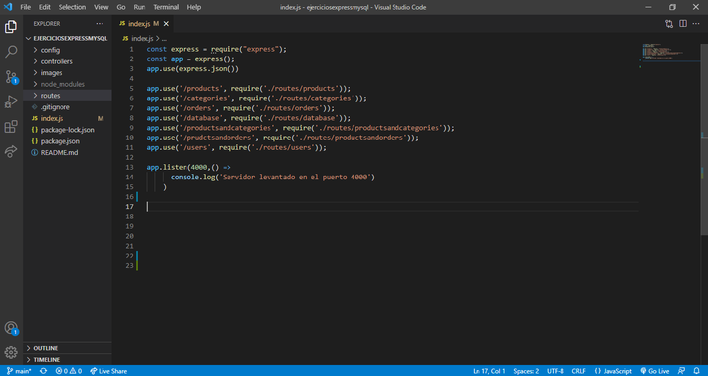

# SQL and Express exercises
Exercises from The Bridge bootcamp, in this case using MySQL and Express combinated to create databases and tables. We also introduced data, adding new products and categories.

## TECHNOLOGIES 🛠️
These exercises were created using Javascript, Node.js, Express and MySQL. The code was written in Visual Studio Code.

### REQUIREMENTS 📋
Visual studio code. Node.js. Also you need to install nodemon, express and mysql.

### HOW TO RUN THIS PROGRAM 🔧
## Geting Started 🚀
- Clone this repository `https://github.com/ivanpuebla10/ejerciciosexpressmysql`
- Install the dependencies `npm install`
- Create a new repo on GitHub: `https://github.com/new`
    - Make sure the "Initialize this repository with a README" option is left unchecked
- Update the remote to point to your GitHub repository: git remote set-url origin `https://github.com/YOUR_GITHUB_USERNAME/YOUR_REPOSITORY_NAME`

## Working on the project 👷‍♂️
* Move into the project directory: `cd ~/YOUR_PROJECTS_DIRECTORY/YOUR_PROJECT_NAME`
* Run the project with : `npm run dev`
    * Server runs at [localhost](https://localhost:65000)
    * Automatically restarts when any of your files change

Using Postman you can see what the database brings and send requests. To see what is happening with the databases that the program is creating open mysql workbench and explore the databases and its tables. 

### Previews

Tables and relations in database:

Routes with Express implemented:

## Author ✒️
* **Ivan Puebla** - *The Bridge* - [ivanpuebla10](https://github.com/ivanpuebla10)
