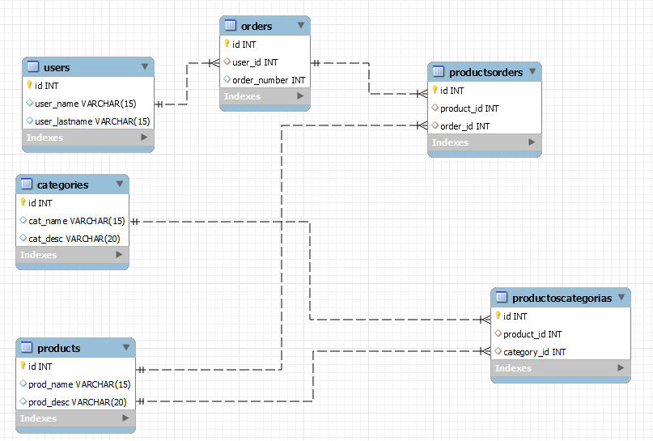

# SQL and Express exercises
Exercises from The Bridge bootcamp, in this case using MySQL and Express combinated to create databases and tables. We also introduced data, adding new products and categories.

## TECHNOLOGIES 🛠️
These exercises were created using Javascript, Node.js, Express and MySQL. The code was written in Visual Studio Code.

### REQUIREMENTS 📋
Visual studio code. Node.js. Also you need to install nodemon, express and mysql.

### HOW TO RUN THIS PROGRAM 🔧
First open the folder in Visual Studio Code, then type "npm init -y", after that install nodemon typing "npm i -D nodemon" and create the scritp "dev":"nodemon index.js" in package.json and type npm run dev in console. 
Using Postman you can see what the database brings and send requests. To see what is happening with the databases that the program is creating open mysql workbench and explore the databases and its tables. 

 

## Author ✒️
* **Ivan Puebla** - *The Bridge* - [ivanpuebla10](https://github.com/ivanpuebla10)